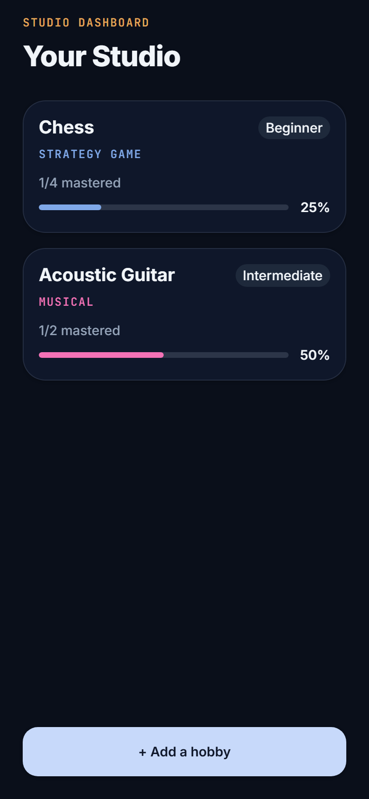
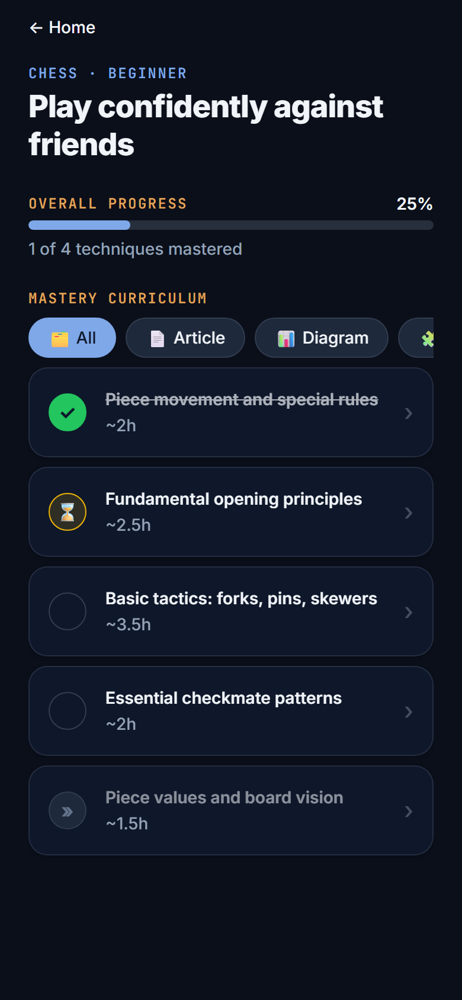
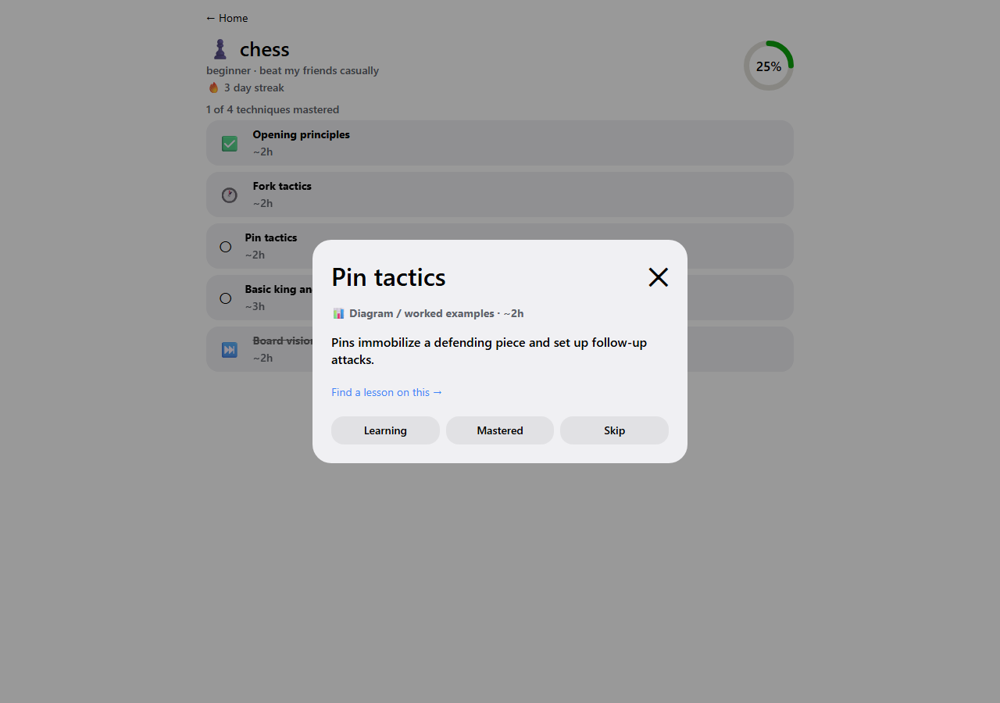

# HobbySensai

Learning a new hobby usually means an afternoon lost to YouTube - dozens of
tabs, no idea which video actually matters, and the whole thing abandoned a
week later. HobbySensai turns that into one focused question: *what 5-8
techniques actually matter for the level I'm at, and in what order?*

Tell it a hobby, your current level, a goal, and how much time you have per
week. It generates a short, ordered technique checklist - each one tagged
with the content format that actually fits it (a video for a physical
motion, a diagram for a tactical pattern, a drill for something you practice
by repetition - never a one-size-fits-all quiz or a video-only lesson for
something that needs a diagram). Check techniques off as you learn them,
skip the ones you don't care about, and track more than one hobby at once,
fully offline after the plan is generated.





## Stack

- **Frontend:** Expo (React Native + `react-native-web`) via `expo-router`, one codebase for mobile and web/desktop.
- **Backend:** Node.js, deployed as Vercel serverless functions under `/api`, co-located in the same project as the frontend.
- **AI:** Google Gemini (`gemini-3.6-flash` by default), called only from the backend.
- **State/storage:** Zustand + `AsyncStorage`, local-only - no accounts, no server-side user data.
- **Validation:** Zod, with one schema shared between the frontend, the backend's request handling, and the backend's validation of the LLM's own output.

## Why local-first, no accounts

The core value here is a checklist you can act on immediately. An account
system doesn't serve that goal, and losing your progress on every reopen
would actively defeat it - so the whole app runs on-device after a plan is
generated, and the backend is stateless (it only ever turns a request into
a plan; it never stores anything about a user).

## Why Gemini, specifically

The goal was a free model with real, usable rate limits - not
just "free" on paper. As of building this, Google's Gemini API free tier
(via an AI Studio key) gives a workable request-per-minute budget without a
billing account attached. One caveat worth knowing if you're evaluating
this: a **Google AI Pro / Gemini Advanced consumer subscription does not
raise the *API* free-tier rate limit** - that's a separate product from API
access, so don't assume having one changes the numbers in Google's API
console.

The AI call goes through one `AIProvider` interface
([`api/_lib/providers/ai/AIProvider.ts`](api/_lib/providers/ai/AIProvider.ts))
with a single Gemini implementation today - adding a second provider (e.g.
as a fallback if the free tier gets rate-limited) is a new file plus a
one-line change to the factory, not a rewrite.

## The part that isn't just "call the LLM and hope"

[`api/_lib/services/learningPlan.service.ts`](api/_lib/services/learningPlan.service.ts)
is the actual engineering here, not the prompt:

1. The request is validated against a Zod schema before the model is ever called.
2. The **same schema** validates the model's JSON response. If it fails
   (malformed JSON, wrong shape, wrong technique count), the service
   re-prompts once with the exact validation error and asks for a
   correction. Only if that also fails does it give up, with a clean typed
   error - never a raw crash or an unvalidated response reaching the app.
3. Every technique's chosen `resourceType` (video / article / diagram /
   interactive / drill) is checked against a deterministic allow-list keyed
   by the hobby's category
   ([`RESOURCE_TYPES_BY_CATEGORY`](src/shared/hobbyPlan.schema.ts)). This is
   the backstop against the exact failure mode this app is designed to
   avoid - an MCQ quiz for chess, an audio-only guitar lesson - it can't
   happen even if the model ignores the prompt's formatting guidance,
   because the guardrail doesn't depend on the model behaving.
4. Responses are cached in-memory (keyed by hobby + level + goal + time
   budget) so retrying or double-submitting doesn't burn another API call.
5. A rate limiter and a fail-fast, Zod-parsed env config
   ([`api/_lib/config.ts`](api/_lib/config.ts)) round out the backend.

## Project structure

```
src/
  app/                    expo-router routes - kept intentionally thin,
                          each route renders exactly one feature component
  features/
    home/                 hobby list, progress rings, streak
    add-hobby/             the generation form
    plan/                  one hobby's technique checklist
    technique-detail/      shared detail content, with platform-specific
                          shells (see below)
  shared/hobbyPlan.schema.ts   the one Zod schema/domain model, imported by
                                both src/ and api/
  store/hobbyPlansStore.ts     Zustand store - holds the HobbyPlan[] array
                                and the streak, persisted via the repository
  lib/storage/hobbyPlansRepository.ts   AsyncStorage + Zod validation, with
                                        a corrupted/old-shape blob falling
                                        back to empty state instead of
                                        crashing app startup
api/
  learning-plan.ts, health.ts       thin Vercel function handlers
  _lib/                              services, providers, validation,
                                      middleware, cache, config, logger
```

### The bottom-sheet-vs-modal pattern

`technique-detail-sheet.tsx` (bottom sheet, mobile) and
`technique-detail-sheet.web.tsx` (centered dialog, desktop/web) both render
the same `TechniqueDetailContent` - only the container differs. This uses
Expo's own `.web.tsx` file-extension convention, the same mechanism the
default template already established for `app-tabs.tsx`.

## Gamification (kept deliberately small)

A streak counter, a progress ring, and a one-line celebration banner on
mastering a technique - reinforcing the app's own checklist loop rather
than becoming a second feature. No badges, levels, or history screen: those
would be exactly the kind of feature that doesn't aid learning, which is
its own explicit anti-pattern here.

## Running it locally

```bash
npm install
cp .env.example .env   # fill in GEMINI_API_KEY (free key from Google AI Studio)

# frontend
npx expo start --web        # or --android / --ios, or scan the QR code in Expo Go

# backend, in a second terminal
npx vercel dev               # serves the /api functions locally
```

By default the app calls same-origin `/api/*`. If you're running the Expo
dev server and `vercel dev` on different ports, set
`EXPO_PUBLIC_API_BASE_URL` in `.env` to point at the `vercel dev` URL.

## Testing

```bash
npm test          # both projects: app (jest-expo + React Native Testing Library) and api (ts-jest)
npm run typecheck # tsc --noEmit against both tsconfig.json and api/tsconfig.json
```

16 tests, chosen for what actually matters rather than for coverage:

- **Backend:** a valid request produces a schema-valid plan; a malformed
  model response triggers the repair retry and succeeds; a response that
  fails twice produces a clean typed error; a resourceType mismatched to
  the hobby's category gets coerced by the guardrail; invalid input is
  rejected before the model is ever called; the rate limiter rejects the
  request past its configured limit.
- **Frontend:** the store updates one hobby's technique without touching
  any other hobby in the array; a mastered/skipped status change
  correctly advances (or doesn't advance) the streak; the progress ring
  renders the right fill at 0/partial/100% and clamps out-of-range input;
  the storage repository round-trips a valid plan and falls back to empty
  state on a corrupted or outdated blob instead of throwing.

## Deployment

One Vercel project serves both halves:

- `vercel.json` builds the Expo web export (`expo export --platform web`
  → `dist/`) as the static site, and Vercel auto-detects the `/api/*.ts`
  files as Node serverless functions.
- A rewrite maps `/plan/:hobbyId` to the static `[hobbyId]` shell so a
  direct link to any hobby's plan resolves correctly, not just in-app
  navigation.
- Set `GEMINI_API_KEY` (and optionally `GEMINI_MODEL`,
  `RATE_LIMIT_MAX_REQUESTS`, `RATE_LIMIT_WINDOW_MS`) as environment
  variables in the Vercel project - never commit `.env`.

Mobile is demoed via `npx expo start` and Expo Go rather than an EAS build - the
project deliberately pins **Expo SDK 54** rather than the newest SDK, since the
public Expo Go app on both the Play Store and App Store was still stuck on SDK 54
at the time of building this (the SDK 57 Expo Go build was in store review on both
platforms). Pinning to 54 means the app installs straight from a QR code scan, no
USB/ADB sideloading or development build required.

## A known limitation

The mobile bottom-sheet variant (`technique-detail-sheet.tsx`) is verified
by type-checking and by the fact that it renders the same, already-verified
content component - it hasn't been visually checked on an actual iOS/Android
simulator in this environment, only the web/desktop modal variant has a
live, in-browser, screenshot-verified pass.
